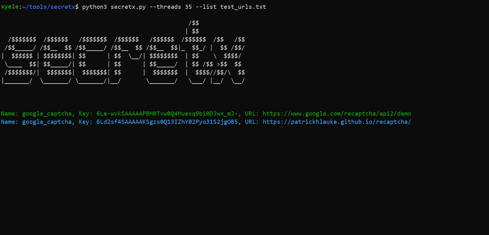

# SecretX
Extracting api keys and secrets by requesting each url at the your list.


### Installation
```
python3 -m pip install -r requirements.txt
```

### Usage
```
python3 secretx.py --list urlList.txt --threads 15

optional arguments: --help  --colorless
  ```
  
### Credits
Thanks to @m4ll0k for patterns and @choudhary_1337 inpsiring for that idea.
